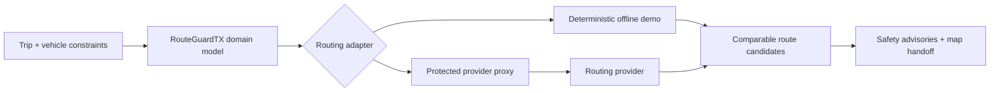

# RouteGuardTX

[](https://github.com/BStofftTX/RouteGuardTX/actions/workflows/ci.yml)
[](https://github.com/BStofftTX/RouteGuardTX/actions/workflows/codeql.yml)
[](https://www.typescriptlang.org/)
[](#project-status)

**A route-planning companion created and owned by MacroStofft.**

RouteGuardTX helps drivers compare route candidates using a selected operating profile: fastest, heavy load/truck, scenic, motorcycle, or towing/RV. It captures vehicle dimensions and preferences such as avoiding sharp turns, low clearances, weight-restricted bridges, poor turnaround access, highways, and tolls.

## Project status

RouteGuardTX is a working planning MVP with deterministic offline route comparisons and a provider-neutral integration layer. It demonstrates the product experience and safety model without representing mock results as verified road restrictions or turn-by-turn navigation.

## Engineering highlights

- Responsive React and TypeScript interface
- Provider-neutral routing domain and adapter architecture
- Protected proxy integration that keeps provider credentials out of the browser
- Deterministic offline adapter for repeatable development and testing
- Google Maps and Apple Maps handoff using documented URL parameters
- Strict separation between planning preferences and verified restrictions
- Unit, production-build, lint, formatting, accessibility, dependency, and CodeQL checks

## Architecture at a glance



The browser never receives provider credentials. Connected routing goes through a RouteGuardTX-controlled proxy that normalizes requests and responses. See [Architecture](docs/ARCHITECTURE.md) for the production topology and safety model.

## What this prototype does

- Runs as a responsive cross-platform web app.
- Captures trip, profile, vehicle, and constraint inputs.
- Produces deterministic offline/mock route comparisons.
- Automatically uses a protected provider proxy when `VITE_ROUTEGUARD_PROXY_URL` is configured.
- Opens the destination in Google Maps or Apple Maps using documented link parameters.
- Defines a provider-neutral adapter and a Google Routes request mapper.
- Clearly distinguishes planning preferences from verified road restrictions.

## What it does not claim

RouteGuardTX is not currently a turn-by-turn navigation engine and does not claim that custom constraints transfer into consumer Google Maps or Apple Maps. The offline adapter does not validate real clearances or legal restrictions.

Google now documents a limited-access Large Vehicle Routing service, but it is provisioned to selected customers and remains best-effort. Apple’s public MapKit/Maps-link surface reviewed for this prototype does not expose truck dimension or clearance controls. See [API limitations](docs/API-LIMITATIONS.md).

## Run

```bash
npm install
npm run dev
```

Open the URL printed by Vite.

For live routing, copy `.env.example` to `.env.local` and point
`VITE_ROUTEGUARD_PROXY_URL` at a RouteGuardTX-controlled server proxy. The proxy
can use openrouteservice's free `driving-hgv` routing profile without exposing
its API credential to the browser.

## Proof

```bash
npm test
npm run build
npm run lint
npm run format:check
npm run test:e2e
```

CI runs unit tests and production builds on Node.js 22, plus a Chromium accessibility check using Playwright and axe-core. CodeQL provides additional static analysis.

## Structure

- `src/domain` — provider-neutral requests, profiles, constraints, results
- `src/adapters` — offline adapter, secure provider-proxy adapter, map-launch links, Google Routes mapper
- `docs/ARCHITECTURE.md` — production architecture and safety model
- `docs/API-LIMITATIONS.md` — verified provider constraints
- `docs/ROADMAP.md` — connected-routing and distribution plan
- `tests` — model, adapter, launch-link, and accessibility tests
- `.github` — CI, CodeQL, dependency updates, and contribution templates

## Security

No provider credentials belong in this repository. Production API calls must go through a protected server-side proxy. Report vulnerabilities privately using the process in [SECURITY.md](SECURITY.md).

## Safety

This software is a planning aid. It cannot guarantee clearance, legal weight, road access, bridge capacity, construction status, or a safe turnaround. Posted signs, law, permits, official restrictions, dispatch instructions, and driver judgment always control.

## Ownership

Copyright © 2026 MacroStofft. RouteGuardTX is a MacroStofft product concept and software prototype. All rights reserved. See [LICENSE.md](LICENSE.md).

External contribution expectations are documented in [CONTRIBUTING.md](CONTRIBUTING.md).
